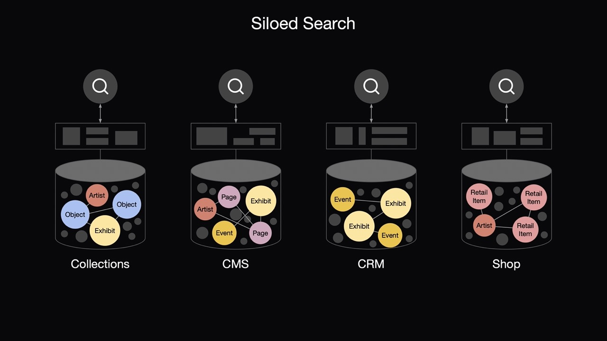
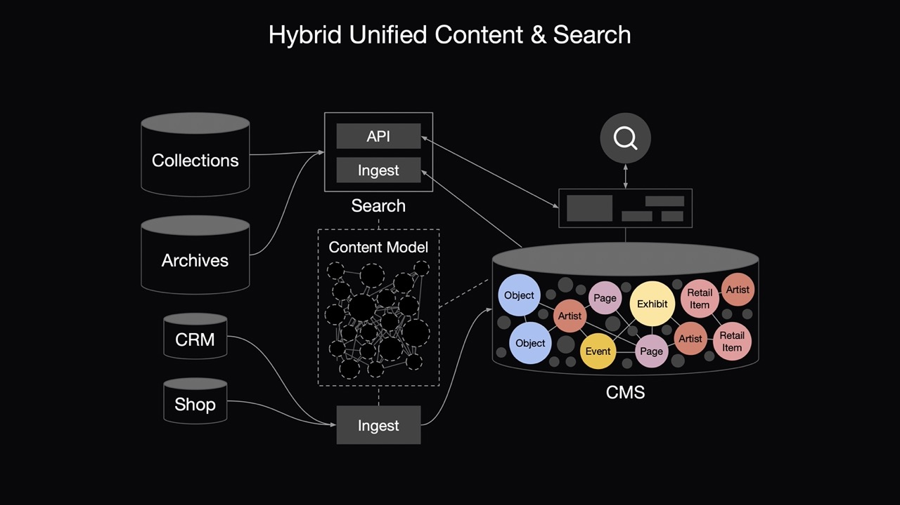
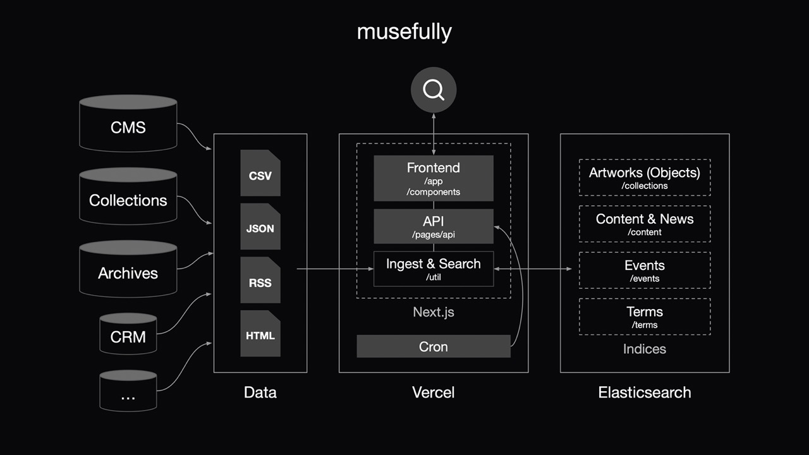
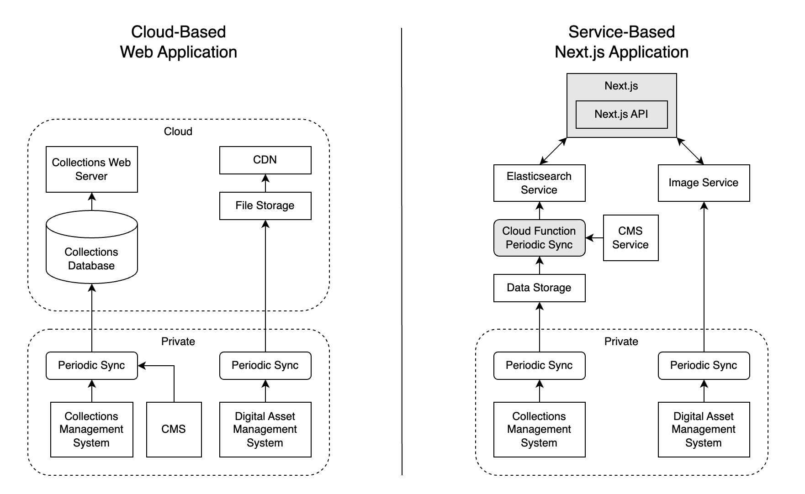
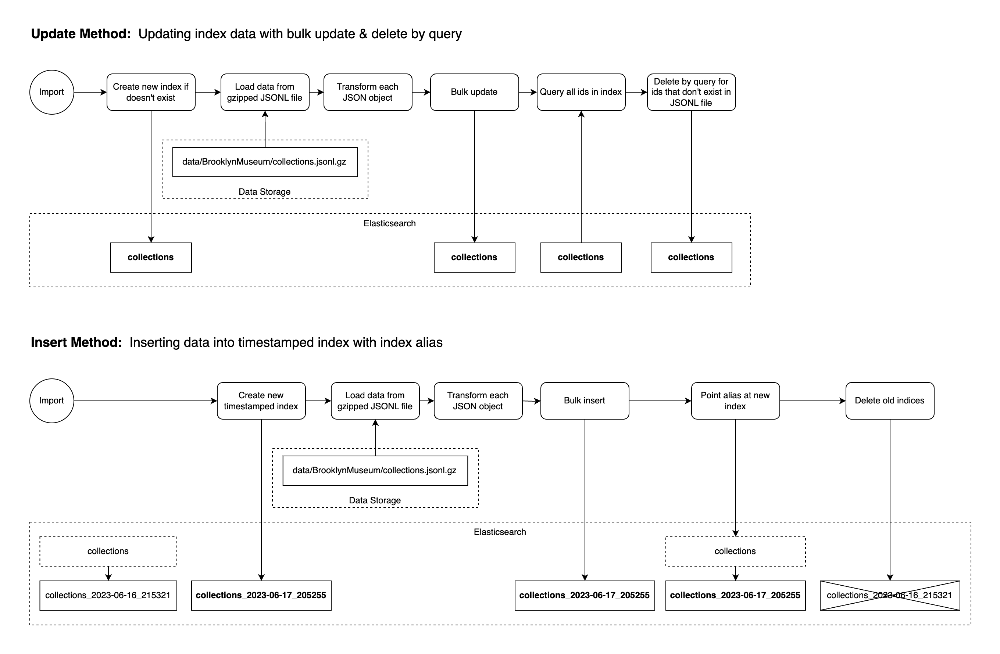
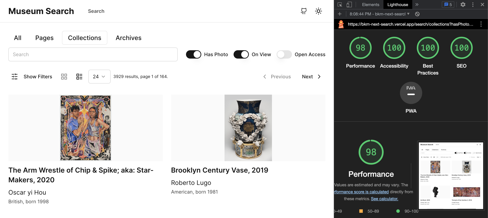
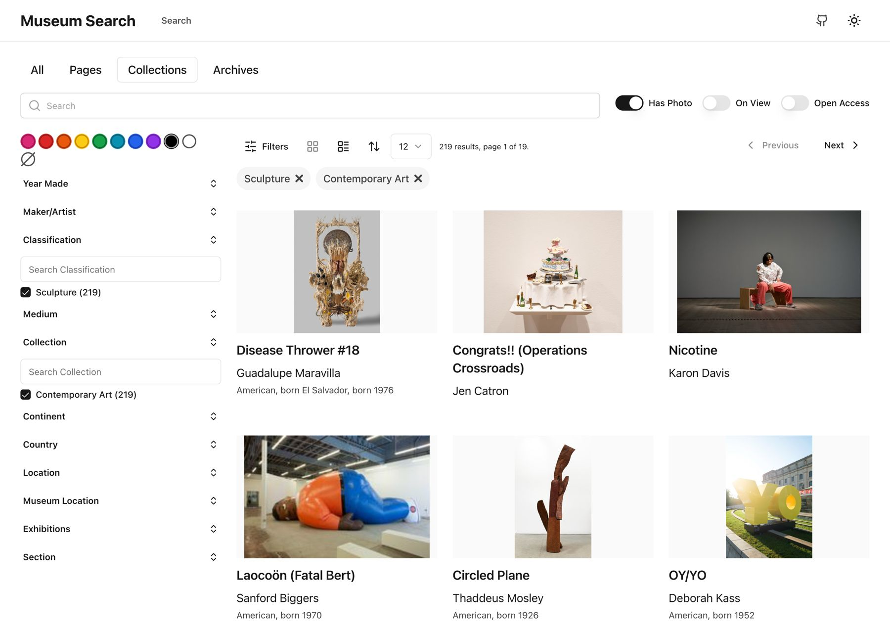
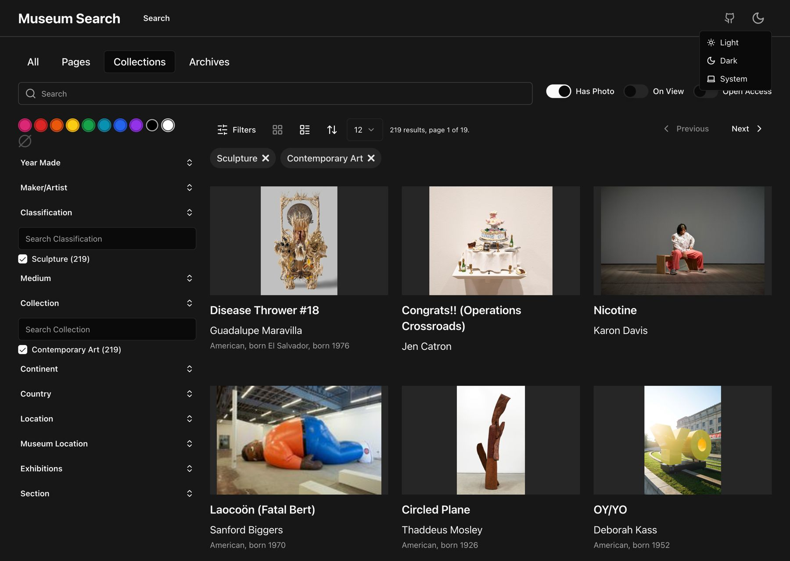
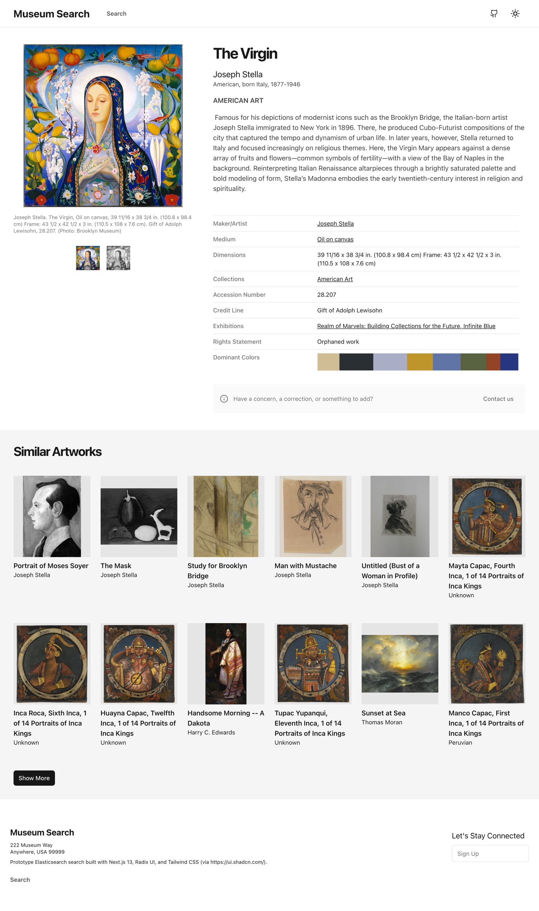

# musefully

The original project, [museum-nextjs-search](https://github.com/derekphilipau/museum-nextjs-search), was suitable for single-organization installations, with indices representing collections objects, website pages, and archives records.

musefully is a more general solution, providing multi-source ingest, new design, and new website at [https://musefully.org](https://musefully.org)

## Intro

Powerful platforms like [Elasticsearch](https://www.elastic.co/) & [Next.js](https://nextjs.org/) make it possible for museums to easily build performant, responsive and accessible faceted searches for their online collections.

## Website

This project has been deployed on Vercel at [https://musefully.org](https://musefully.org)

## Overview

Organizations often run multiple systems, including various CMS platforms added over time as well as SaaS platforms like Shopify.  Content and search is siloed within each system.



Ideally, we'd like to search all our content in one search interface.  One simple solution is syncing systems with the CMS, so that the CMS contains representations of all content.


Two issues from this approach may arise:
1. Compared to specialized search engines like Elasticsearch, the CMS platform might not be as suitable for building a faceted search API.
2. Increasing the number of documents and queries may increase CMS costs.

Although more complex, it may be best to add a dedicated search engine to take advantage of advanced querying & faceting features.  Large datasets, like Collections and Archives, can be synced to Search instead of the CMS.  The CMS can use the Search API to reference content that is only included in the Search platform.



This project is based on the hybrid approach using a dedicated search engine.  Next.js provides the Frontend, API, and Ingest & Search functionality, with Elasticsearch as the search engine.



## Museum Collections Systems

A typical approach for building a collections website is to periodically sync data from a backend collections management system (sometimes augmented with data from an internal CMS) into a relational database which is queried by a frontend website.

This project takes a different approach, using Elasticsearch as the primary data store and Next.js as the frontend. Note that the collections data is read-only, the actual datastore is in the backend system. Using the last exported files, the Elasticsearch indices can be rebuilt in just a few minutes, even with collections of 200,000 documents.



### Importing data

The original project, [museum-nextjs-search](https://github.com/derekphilipau/museum-nextjs-search), used two methods of updated indices, update and insert, which are detailed below.

musefully only uses the update technique.



#### Update Method

The update method loads data from a JSONL file and updates documents in an index. If the document doesn't already exist, it is created. Document fields are updated with new information, but fields not contained in the data file are not updated. For example, the image.dominantColor field is not present in the original data file, as it is populated by another script, so that information is preserved across updates. Note that it may be necessary to force an update of calculated fields, for example if the primary image of an object has changed. Also note that approach will fail for nested fields.

#### Insert method

The insert method completely repopulates an index from a JSONL data file. To avoid any downtime, first a timestamped index is created and populated, then the alias is pointed at the newly-created index. This will completely rebuild an index with each sync, and any calculated field values will be lost.

## Datasets

### Collections Data

Data has been collected from a number of sources, and more sources will be added over time:

- [Brooklyn Museum](https://www.brooklynmuseum.org), via [Brooklyn Museum Open API](https://www.brooklynmuseum.org/opencollection/api/docs).
- [MoMA](https://www.moma.org/), dataset on Github [here](https://github.com/MuseumofModernArt/collection).
- [The Met](https://www.metmuseum.org/), dataset on Github [here](https://github.com/metmuseum/openaccess)

### RSS Feeds

- [Hyperallergic](https://hyperallergic.com/), [Feed](https://hyperallergic.com/feed/)
- [MOMA](https://stories.moma.org/), [Feed](https://stories.moma.org/feed)
- [Cooper Hewitt](https://www.cooperhewitt.org/blog/), [Feed](https://www.cooperhewitt.org/blog/feed/)
- [Victoria & Albert Museum](https://www.vam.ac.uk/blog), [Feed](https://www.vam.ac.uk/blog/feed)
- [Seattle Art Museum](https://samblog.seattleartmuseum.org/), [Feed](https://samblog.seattleartmuseum.org/feed/)
- [Milwaukee Art Museum](https://blog.mam.org/), [Feed](https://blog.mam.org/feed/)
- [ArtNews](https://www.artnews.com/), [Feed](https://www.artnews.com/feed/)

### Additional Metadata

It's often necessary to augment backend collection data with additional metadata. For example, theme tags like "Climate Justice" might be associated with artworks in a CMS rather the backend collections management system. The "sortPriority" field allows one to prominently display specific documents by adjusting the ordering in default searches. This additional metadata is stored in `data/BrooklynMuseum/additionalMetadata.jsonl`, but could just as easily be exported from a CMS.

### Getty Union List of Artist Names (ULAN) Data

ULAN XML was downloaded from [Getty's website](http://ulandownloads.getty.edu/) and converted to JSON using the `ulanXmlToJsonConvert.ts` script. When updating the `terms` index, the script attempts to find a matching artist name from this JSON file. If found, the ULAN artist data is added to the terms index document.

## Elasticsearch

### Elasticsearch DSL

This project uses Elasticsearch [Query DSL](https://www.elastic.co/guide/en/elasticsearch/reference/current/query-dsl.html) with the Elasticsearch [Javascript Client](https://www.elastic.co/guide/en/elasticsearch/client/javascript-api/current/index.html) to manage indices and query data.

### Elasticsearch Field Types

Basic Elasticsearch index, field types, analyzers, and filters are defined in `util/elasticsearch/settings.ts`.

### Index Definition

Adjust number_of_shards and number_of_replicas for your use case.

#### Analyzers & Filters

[Mapping Character Filters](https://www.elastic.co/guide/en/elasticsearch/reference/current/analysis-mapping-charfilter.html):

- `hyphenApostropheMappingFilter` - replaces hyphens with spaces and removes single quotes.
- `articleCharFilter` - UNUSED - replaces common articles (de, van, der, etc.) with spaces. Originally intended to help with searching names containing many articles.

[Filters](https://www.elastic.co/guide/en/elasticsearch/reference/current/analysis-tokenfilters.html):

- `enSnowball` - stems words using a [Snowball-generated stemmer](https://www.elastic.co/guide/en/elasticsearch/reference/current/analysis-snowball-tokenfilter.html) for English language

[Analyzers](https://www.elastic.co/guide/en/elasticsearch/reference/current/analyzer.html):

- `unaggregatedStandardAnalyzer` - For common text fields that are not aggregated.
- `aggregatedKeywordAnalyzer` - For aggregated keyword fields
- `suggestAnalyzer` - For search_as_you_type fields

#### Field definitions

Most definitions are straight-forward. Some search and suggest fields contain subfields "search" and "suggest" used for those use-cases.

### Elasticsearch Indices

Indices are defined in `/util/elasticsearch/indices.ts`.

### Re-used Object Fields

Some object fields are re-used across multiple indices.

Constituent:

- `id` - Source-dependent ID of the constituent
- `name` - Name of the constituent, e.g. "Pablo Picasso"
- `dates` - A free-form string representing the dates of a constituent, often the birth & death of an artist, e.g. "ca. 1483–1556"
- `birthYear` - Birth year of the constituent
- `deathYear` - Death year of the constituent
- `nationality` - Array of nationalities of the constituent
- `gender` - Gender. Note that ULAN seems to only record 'Male', 'Female', and 'N/A'
- `role` - Role of the constituent, e.g. "Artist", "Maker", "Photographer", etc.
- `source` - Source of the constituent, e.g. "Brooklyn Museum", "Getty ULAN"
- `sourceId` - Source-dependent ID of the constituent
- `wikiQid` - Wikidata QID of the constituent
- `ulan` - ULAN record for the constituent

Geographical Location:

- `id` - Source-dependent ID of the location
- `name` - Name of the location, e.g. "New York, New York, United States"
- `continent` - Continent of the location, e.g. "North America"
- `country` - Country of the location, e.g. "United States"
- `type` - Type of location, e.g. "City", "State", "Country", etc.

Image:

- `url` - The URL of the image
- `thumbnailUrl` - The URL of the thumbnail
- `alt` - The alt text for the image
- `dominantColors` - An array of arrays of HSL colors and other information used for color search
- `year` - The year of the image
- `view` - The view of the image, e.g. "front", "back", "detail", etc.
- `rank` - The rank of the image, used for sorting
- `embedding` - Experimental Feature. CLIP image embedding for similarity & text search. Removed. [See examples here.](./doc/embeddings.md)

Museum Location:

- `id` - Source-dependent ID of the location
- `name` - Name of the location, e.g. ""
- `isPublic` - Whether the location is public
- `isFloor` - Whether the location is a floor
- `parentId` - The ID of the parent location

#### Base Document

The base document defines common fields for all indices, these are the fields used for cross-index search. The Elasticsearch Base Document fields are defined in `indices.ts` and the associated Typescript interface is defined in `/types/baseDocument.ts`.

- `type` - The type of document, e.g. "object", "terms"
- `source` - The source of the document, e.g. "Brooklyn Museum", "Getty ULAN"
- `url` - The URL of the document
- `id` - The unique ID of the document
- `title` - The title of the document
- `description` - The description of the document
- `searchText` - The text used for full-text search. This can be configured on a per-index basis to allow global search to include special fields like accession number.
- `keywords` - An array of keywords for the document
- `boostedKeywords` - An array of keywords that should be boosted in search results
- `primaryConstituent` - The primary constituent of the document, e.g. the artist of a painting.
- `image` - Image. The main image of the document
- `date` - Date the document was created, not currently used.
- `formattedDate` - A string representing the date, no strict format.
- `startYear` - An integer representing the start date year. Used for year range filtering.
- `endYear` - An integer representing the end date year. Used for year range filtering.
- `sortPriority` - Integer representing the priority or weight of a document. Allows for default search results customization.

Note on dates: Museum objects have a wide range of dates from pre-historic BCE to contemporary CE that ISO 8601 cannot represent, hence the use of signed integers to represent years.

#### Collection Document

Includes all Base Document fields as well as:

- `constituents` - Constituent array. Entities associated with the document, e.g. artists, photographers, organization, etc.
- `images` - Image array. Images associated with the document.
- `accessionNumber` - The accession number.
- `accessionDate` - Free-form date field for accession date.
- `period` - The period, e.g. "Edo Period", "Middle Kingdom", etc.
- `dynasty` - The dynasty, e.g. "Qing Dynasty", "Mughal", etc.
- `provenance` - Free-text field describing provenance.
- `medium` - The medium, e.g. "Oil on canvas", "Woodblock print", etc.
- `dimensions` - The dimensions, e.g. "Sheet: 14 1/2 x 10 1/4 in. (36.8 x 26 cm)" TODO: Normalize dimensions into standardized fields.
- `edition` - The edition, e.g. "Edition: 23/50"
- `portfolio` - The portfolio, e.g. "Scenes from the Life of Saint Lawrence"
- `markings` - Markings on object, e.g. "Stamped on back: 'HERTER BRO'S.'"
- `signed` - Signature on object, e.g. "Kunichika ga 国周画"
- `inscribed` - Inscription on object
- `creditLine` - Credit line, e.g. "Dick S. Ramsay Fund"
- `copyright` - Copyright, e.g. "© Park McArthur"
- `classification` - Classification, e.g. "Print", "Sculpture", "Painting", etc.
- `publicAccess` - Boolean, if true is public access.
- `copyrightRestricted` - Boolean, if true images are restricted.
- `highlight` - Boolean whether or not object is highlighted. TODO: Remove, Brooklyn Museum-specific.
- `section` - Museum-specific gallery section, e.g. "Old Kingdom"
- `museumLocation` - Museum Location. Museum-specific location within museum
- `onView` - Whether or not the object is currently on view.
- `rightsType` - Specifies copyright type, e.g. "Creative Commons-BY"
- `labels` - Array of gallery labels. TODO: Define type & add to searchText?
- `departments` - An array of departments/collections the object belongs to.
- `exhibitions` - An array of exhibitions the object has been in. TODO: Assumes exhibitions have unique names.
- `geographicLocations` - Geographical Location array. Geographic locations associated with the object.
- `primaryGeographicalLocation` - Geographical Location. The primary location associated with the object.

#### Content Document

Content documents represent a web page or resource, typically from a museum's website. The fields are the same as Base Document.

#### Terms Document

Terms documents represent terms from a controlled vocabulary. These are queried for "did you mean?" searches. The fields are the same as Base Document with the addition of:

- `sourceId`: The ID of the term in the source vocabulary.
- `sourceType`: The type of the term within the source vocabulary.
- `index`: The index the term belongs to, e.g. "collections".
- `field`: The field the term belongs to, e.g. "classification", "primaryConstituent.canonicalName"
- `value`: The value of the term, e.g. "Painting", "Pablo Picasso", etc.
- `preferred`: The preferred term, e.g. "Pablo Picasso"
- `alternates`: An array of alternate terms, e.g. ["Picasso, Pablo", "Picasso", etc.]
- `summary`: A summary of the term. Deprecated, use data fields instead.
- `description`: A description of the term. Deprecated, use data fields instead.
- `data`: The raw data of the term, e.g. the JSON from the Getty ULAN.

### Elasticsearch Queries

##### Multi-match Search

Text queries are currently searched with multi_match default [`best_fields`](https://www.elastic.co/guide/en/elasticsearch/reference/current/query-dsl-multi-match-query.html). Fields can be weighted to give priority, in this case `boostedKeywords` is very heavily weighted for cases where you want a document to appear first if it contains an important keyword.

```
multi_match: {
    query: q,
    type: 'cross_fields',
    operator: 'and',
    fields: [
        'boostedKeywords^20',
        'primaryConstituent.canonicalName.search^4',
        'title.search^2',
        'keywords^2',
        'description',
        'searchText',
    ],
},
```

#### Collection Object Similarity

How one defines object similarity will vary from institution to institution. There are a number of approaches to querying Elasticsearch for similar documents, notably [`more_like_this`](https://www.elastic.co/guide/en/elasticsearch/reference/current/query-dsl-mlt-query.html).

This project uses a custom bool query of boosted should terms. [similarObjects.ts](./util/elasticsearch/search/similarObjects.ts) specifies which fields are used along with a boost value for each. The primary constituent (e.g. Artist, Maker, etc.) is given the most weight. These fields can be adjusted based on your institution's concept of object similarity. The current weights are:

- `primaryConstituent.canonicalName.search` - 6
- `dynasty` - 2
- `period` - 2
- `classification` - 1.5
- `medium` - 1
- `departments` - 1
- `exhibitions` - 1
- `primaryGeographicalLocation.name` - 1

## Next.js template

Based on https://github.com/shadcn/next-template ([Website](https://template.shadcn.com/), [UI Components](https://ui.shadcn.com/)),
which is an implementation of [Radix UI](https://www.radix-ui.com/) with [Tailwind](https://tailwindcss.com/) and other helpful utilities.

## Features

- Full-text search, including accession number
- API Endpoints for search & document retrieval
- Searchable filters
- Linked object properties
- Custom similarity algorithm with combined weighted terms (can be adjusted)
- Dominant color similarity using HSV color space.
- Embedded JSON-LD (Schema.org [VisualArtwork](https://schema.org/VisualArtwork)) for better SEO and sharing
- Image Zoom with [Openseadragon](https://openseadragon.github.io/)
- Image carousel with [embla-carousel](https://www.embla-carousel.com/get-started/react/)
- Form handling via [Formspree](https://formspree.io/)
- Meta & OG meta tags
- [lucide-react icons](https://github.com/lucide-icons/lucide)
- [Tailwind CSS](https://tailwindcss.com/)
- [next-themes](https://github.com/pacocoursey/next-themes) dark/light modes
- [@next/font](https://nextjs.org/docs/api-reference/next/font) font loading

## Experimental Features

Similarity based on OpenAI CLIP Embeddings stored in Elasticsearch dense vectors worked well, but slowed down my mini server. [You can learn more about it here.](https://github.com/derekphilipau/museum-nextjs-search/blob/main/doc/embeddings.md), and the old code is [feature-experimental-clip](https://github.com/derekphilipau/museum-nextjs-search/tree/feature-experimental-clip) branch. [The code here](https://github.com/derekphilipau/elastic-clip-museum-search) was used to add the embeddings via a Colab notebook, but it's a hack.

## Adopt it yourself

It's hoped that all you need to do is 1) Export collections data to JSON, and 2) Write a transformer to convert the JSON to match the format of the Elasticsearch index.

## API Endpoints

### Search API

Searches can be performed against any index. Search requests are of the form:
GET `http://localhost:3000/api/search?[querystring]`

Querystring parameters are the same as those for the Web UI:
GET `http://localhost:3000/api/search?index=art&f=true&primaryConstituent.canonicalName=George%20Bradford%20Brainerd`

### Document API

Document requests are of the form:
GET `http://localhost:3000/api/search/document?index=art&id=[documentId]`

For example, to get collection object with id `bkm_225001`:
GET `http://localhost:3000/api/search/document?id=bkm_225001&index=art`

### RSS Sync API

Sync RSS feeds:
POST `http://localhost:3000/api/import/rss`

Parameters: Content-Type application/json, raw body `{ "secret": "dfJtqJDG9VwN69edUU283qnD"}`

## Installation & Running

### Set up Elasticsearch

You can run Elasticsearch in a Docker container locally or in the cloud, or [sign up for an Elasticsearch Cloud account](https://cloud.elastic.co/).

#### Non-cloud Elasticsearch

The `/docker` folder contains a docker-compose config file for running Elasticsearch locally. You can run it with `docker-compose up`. See related article, ["Start a multi-node cluster with Docker Compose"](https://www.elastic.co/guide/en/elasticsearch/reference/current/docker.html#docker-compose-file). Alternatively, use [Elastic stack (ELK) on Docker](https://github.com/deviantony/docker-elk).

##### Non-cloud post-install

**API Key**

Generate an API key (in Kibana: Stack Management > API Keys > Create API key). Once you've generated a key, copy the Base64 value to the `ELASTICSEARCH_API_KEY` variable in the .env.local file.

**CA Cert**

Copy the Elasticsearch container's CA certificate and put it in `/secrets`. If you're using this project's docker-compose.yml:

`docker cp musefully-es01-1:/usr/share/elasticsearch/config/certs/es01/es01.crt ./secrets/`

Update .env.local `ELASTICSEARCH_CA_FILE` variable with the crt file location.

### Environment Variables

Once you have a running Elasticsearch service, you can add the connection details to the environment variables.

For local development, add a local `.env.local` file in the root directory. If `ELASTICSEARCH_USE_CLOUD` is "true", the Elastic Cloud vars will be used, otherwise the \_HOST, \_PROTOCOL, \_PORT, \_CA_FILE, and \_API_KEY vars will be used. You may need to copy the http_ca.crt from the Elasticsearch Docker container to a local directory like `./secrets`.

On [Formspree](https://formspree.io/) you should set up a basic contact form and enter the `FORMSPREE_FORM_ID` env variable.

For cloud deployments (for example on Vercel), add the same variables to the Environment Variables of your deployment.

```
ELASTICSEARCH_USE_CLOUD=true
ELASTICSEARCH_CLOUD_ID=elastic-museum-test:dXMtY2VudlasfdkjfdwLmNsb3VkLmVzLmlvOjQ0MyQ5ZDhiNWQ2NDM0NTA0ODgwadslfjk;ldfksjfdlNmE2M2IwMmaslfkjfdlksj2ZTU5MzZmMg==
ELASTICSEARCH_CLOUD_USERNAME=elastic
ELASTICSEARCH_CLOUD_PASSWORD=changeme
ELASTICSEARCH_HOST=localhost
ELASTICSEARCH_PROTOCOL=https
ELASTICSEARCH_PORT=9200
ELASTICSEARCH_CA_FILE=./secrets/http_ca.crt
ELASTICSEARCH_API_KEY=DssaSLfdsFKJidsljfakslfjfLIJEWLiMkJPQzNwSzVmQQ==
ELASTICSEARCH_BULK_LIMIT=2000
FORMSPREE_FORM_ID=mskbksar
```

### Download & Install

Fork/download this project and run `npm i` to install dependencies.

Then, run the development server with `npm run dev` and open http://localhost:3000 with your browser to see the result.

If you have not yet loaded the Elasticsearch data, you should see an error on the search page that the index does not exist.

### Loading the data

From the command line, run: `npm run import`

Data files are stored in `/data/[source]/[index].jsonl.gz`.
The import script, `importDataCommand.ts`, will load compressed data from .jsonl.gz files in the data directory into Elasticsearch indices. **_Warning: This will modify Elasticsearch indices._**

This command will:

1. Load environment variables from `.env.local`
2. Ask if you want to proceed with the import
3. Ask if you want to import the art index (all records)
4. Ask if you want to import the content index (all records)
5. Ask if you want to update dominant colors. This will only update colors for images which haven't already been analyzed.
6. Ask if you want to update RSS feeds to the content index.

The import process will take some time, as it inserts 2000 documents at a time using Elasticsearch bulk and then rests for a couple seconds.

## License

Licensed under the [MIT license](./LICENSE.md).

## Lighthouse Score

One should see 100's across the board for the Lighthouse score. Slightly lower score for performance due to relying on external image CDN.



## Screenshots

Light mode example:



Dark mode example:



Color search example:


Object page example:


