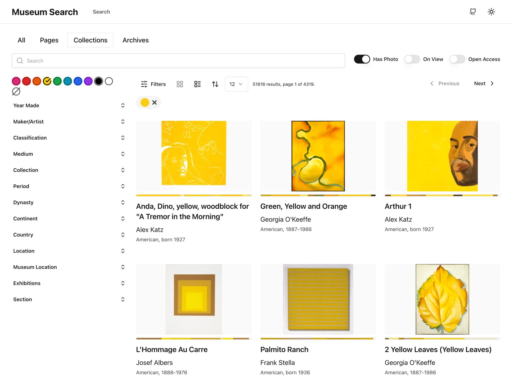

# musefully

## Intro

Powerful platforms like [Elasticsearch](https://www.elastic.co/) & [Next.js](https://nextjs.org/) make it possible for museums to easily build performant, responsive and accessible faceted searches for their online collections.

Based on [shadcn/next-template](https://github.com/shadcn/next-template), which is an implementation of [Radix UI](https://www.radix-ui.com/) with [Tailwind CSS](https://tailwindcss.com/).

This project has been deployed on Vercel at [https://musefully.org](https://musefully.org)

## Documentation:

* [Setup Guide](./docs/SETUP.md)
* [Architecture](./docs/ARCHITECTURE.md)
* [Datasets, Vocabularies & Schema](./docs/SCHEMA.md)
* [API](./docs/API.md)

## Features

- Full-text search, including accession number
- API Endpoints for search & document retrieval
- Searchable filters
- Linked object properties
- Custom similarity algorithm with combined weighted terms (can be adjusted)
- Dominant color similarity using HSV color space.
- Embedded JSON-LD (Schema.org [VisualArtwork](https://schema.org/VisualArtwork)) for better SEO and sharing
- Image Zoom with [Openseadragon](https://openseadragon.github.io/)
- Image carousel with [embla-carousel](https://www.embla-carousel.com/get-started/react/)
- Form handling via [Formspree](https://formspree.io/)
- Meta & OG meta tags
- [lucide-react icons](https://github.com/lucide-icons/lucide)
- [Tailwind CSS](https://tailwindcss.com/)
- [next-themes](https://github.com/pacocoursey/next-themes) dark/light modes
- [@next/font](https://nextjs.org/docs/api-reference/next/font) font loading

## Experimental Features

Similarity based on OpenAI CLIP Embeddings stored in Elasticsearch dense vectors worked very well, but was too costly for the purposes of this project. [See results here.](./docs/EMBEDDINGS.md).

## License

Licensed under the [MIT license](./LICENSE.md).

## Lighthouse Score

One should see 100's across the board for the Lighthouse score. Slightly lower score for performance due to relying on external image CDN.

## Screenshots

Light mode example:

Dark mode example:

Color search example:

Object page example:

