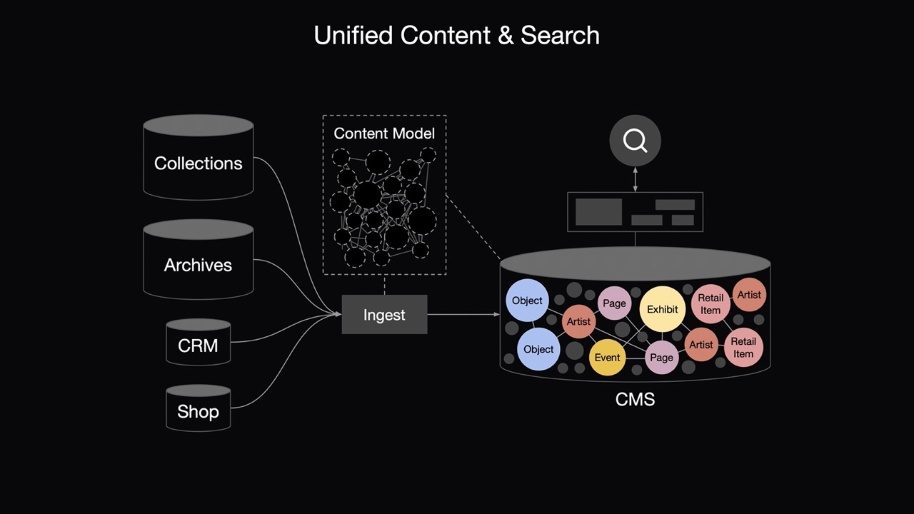

# Architecture

The original project, [museum-nextjs-search](https://github.com/derekphilipau/museum-nextjs-search), was suitable for single-organization installations, with indices representing collections objects, website pages, and archives records.

musefully is a more general solution, providing multi-source ingest, new design, and new website at [https://musefully.org](https://musefully.org)

## Overview

Organizations often run multiple systems, including various CMS platforms added over time as well as SaaS platforms like Shopify.  Content and search is siloed within each system.

Ideally, we'd like to search all our content in one search interface.  One simple solution is syncing systems with the CMS, so that the CMS contains representations of all content.

Two issues from this approach may arise:
1. Compared to specialized search engines like Elasticsearch, the CMS platform might not be as suitable for building a faceted search API.
2. Increasing the number of documents and queries may increase CMS costs.

Although more complex, it may be best to add a dedicated search engine to take advantage of advanced querying & faceting features.  Large datasets, like Collections and Archives, can be synced to Search instead of the CMS.  The CMS can use the Search API to reference content that is only included in the Search platform.

This project is based on the hybrid approach using a dedicated search engine.  Next.js provides the Frontend, API, and Ingest & Search functionality, with Elasticsearch as the search engine.

## Museum Collections Systems

A typical approach for building a collections website is to periodically sync data from a backend collections management system (sometimes augmented with data from an internal CMS) into a relational database which is queried by a frontend website.

This project takes a different approach, using Elasticsearch as the primary data store and Next.js as the frontend. Note that the collections data is read-only, the actual datastore is in the backend system. Using the last exported files, the Elasticsearch indices can be rebuilt in just a few minutes, even with collections of 200,000 documents.

### Importing data

The original project, [museum-nextjs-search](https://github.com/derekphilipau/museum-nextjs-search), used two methods of updated indices, update and insert, which are detailed below.

musefully only uses the update technique.

#### Update Method

The update method loads data from a JSONL file and updates documents in an index. If the document doesn't already exist, it is created. Document fields are updated with new information, but fields not contained in the data file are not updated. For example, the image.dominantColor field is not present in the original data file, as it is populated by another script, so that information is preserved across updates. Note that it may be necessary to force an update of calculated fields, for example if the primary image of an object has changed. Also note that approach will fail for nested fields.

#### Insert method

The insert method completely repopulates an index from a JSONL data file. To avoid any downtime, first a timestamped index is created and populated, then the alias is pointed at the newly-created index. This will completely rebuild an index with each sync, and any calculated field values will be lost.
